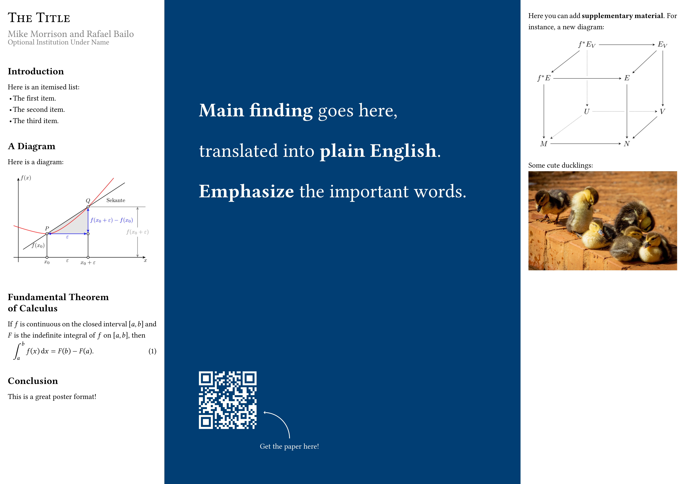
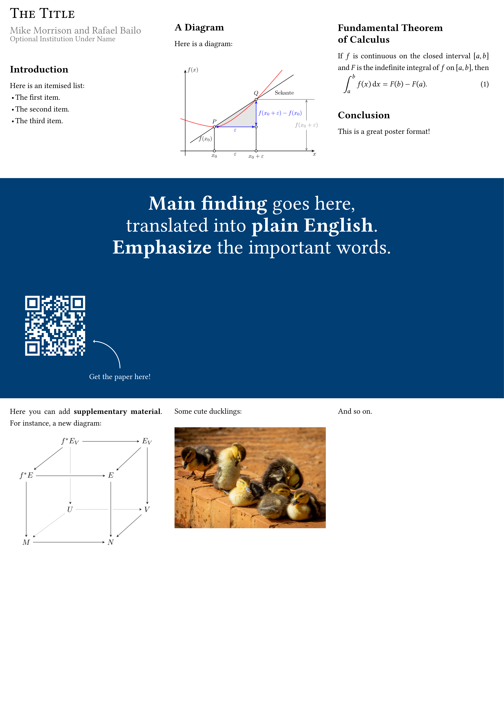
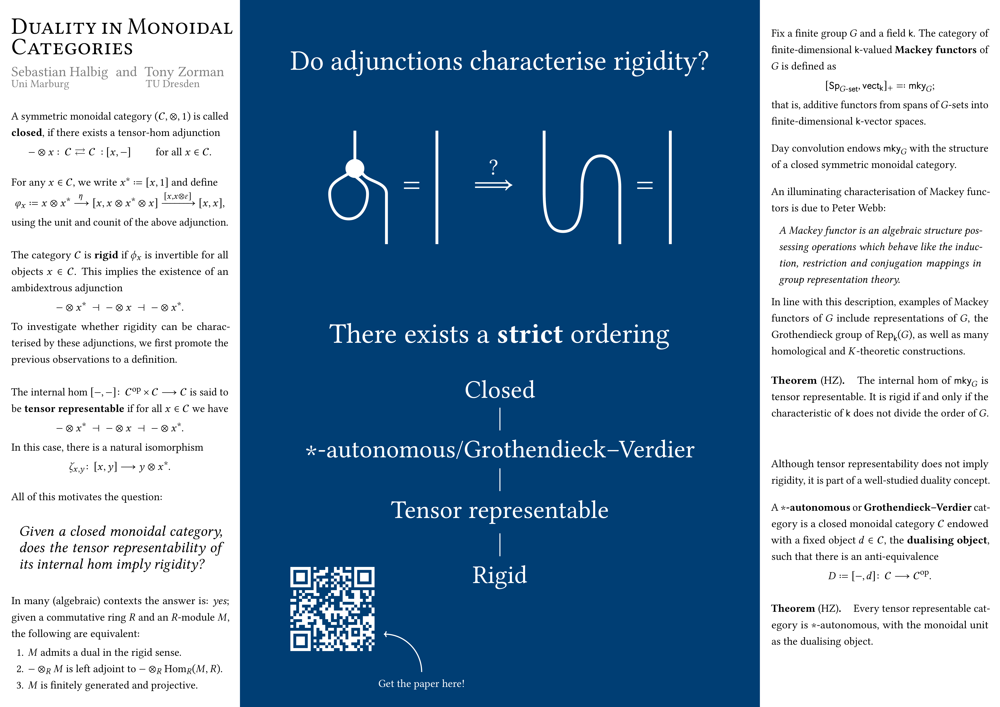
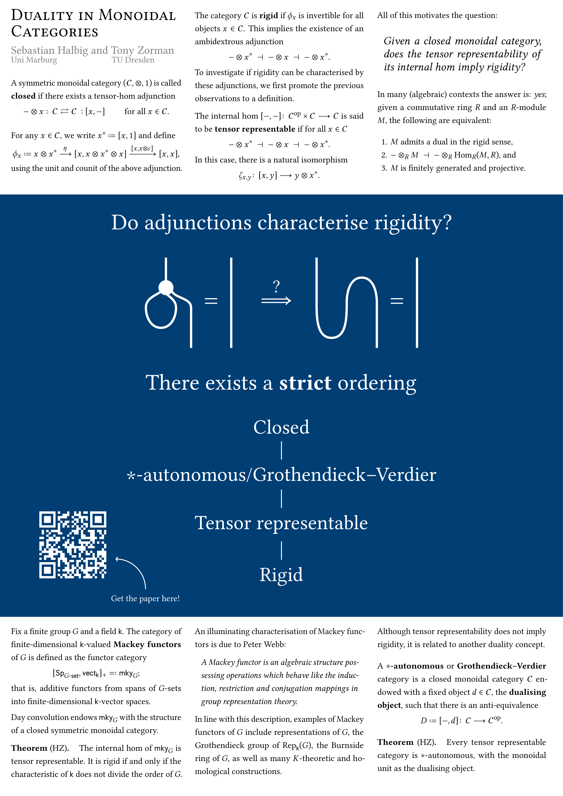

# Betterposter

A [betterposter][bp] LaTeX class,
based on Rafael Bailo's [betterposter-latex-template][bp-latex] template.

The difference between that version and this repository are the following:

  - The class now—with the help of [tikzposter]—also provides a portrait version of betterposter.

  - Fonts and (default) font-sizes have been slightly tweaked.

  - All commands regarding QR codes have been removed;
    this is better handled by the `qrcode` package.

  - For simplicity,
    all options regarding size have been removed,
    with A0 now being the one and only option.

# Examples

## Landscape version

The landscape version,
to be found in [example-landscape.tex](./example-landscape.tex),
looks the same as in the original:

## Portrait version

This is a minimally adapted variant of the landscape version,
to be found in [example-portrait.tex](./example-portrait.tex):

## Real world examples

### Landscape

### Portrait

[bp-latex]: https://github.com/rafaelbailo/betterposter-latex-template
[bp]: https://www.youtube.com/watch?v=1RwJbhkCA58&feature=youtu.be
[tikzposter]: https://www.ctan.org/pkg/tikzposter
